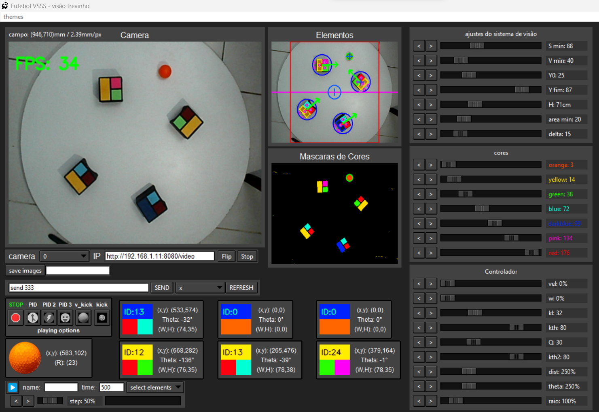

# Futebol_VSSS
Visão, comunicação, controle e planejamento de trajetorias pra uso no Futebol VSSS.

# Bibliotecas:
* Numpy
* OpenCV
* Tkinter
* ttkthemes
* PySerial

# Modulos deste repositório:
| nome do arquivo  | descrição                                   | dependências internas                                 |
| :--------------: | :------------------------------------------ | :---------------------------------------------------- |
| main.py          | codigo principal do futebol VSSS            | datalogger.py, gui.py, vision_thread.py, controle.py  |
| gui.py           | interface gráfica desenvolvida              | widgets.py                                            |
| widgets.py       | widgets para a interface gráfica (Tkinter)  | transmissor.py (na classe serial_consol)              |
| vision_thread.py | código da thread de visão computacional     | nenhuma                                               |
| transmissor.py   | comunicação serial                          | nenhuma                                               |
| controle.py      | classes e funções de controle pid e outros  | nenhuma                                               |
| datalogger.py    | coleção de dados                            | nenhuma                                               |

